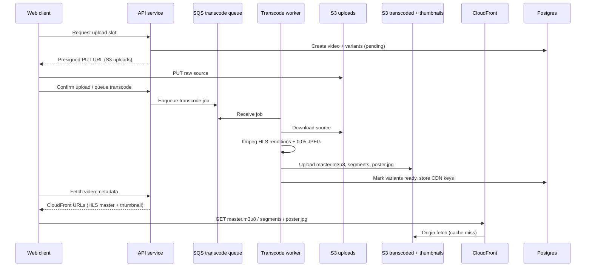

# Video transcoding pipeline architecture

This document describes the target architecture for asset delivery in the video transcoding pipeline. Infrastructure is provisioned in the dedicated CloudFormation repository; this repo owns application behavior, storage layout, and API contracts.


## Goals

- Serve playback assets globally through **CloudFront** instead of per-request S3 presigned GET URLs.
- Store adaptive streams as **HLS** (`.m3u8` + `.ts` segments) in S3, not single-file MP4 variants.
- Generate one **thumbnail per video** by extracting the frame at **00:00:05** and storing it as a JPEG in S3.
- Keep raw uploads on a private S3 path with presigned PUT; only processed assets are CDN-backed.

## High-level flow



## Storage layout

### Buckets (owned by CloudFormation repo)

| Bucket | Access | Purpose |
|--------|--------|---------|
| `vtp-uploads` | Private; presigned PUT/GET from workers only | Raw source files from browser or yt-dlp |
| `vtp-transcoded` | Private; CloudFront OAC read | HLS manifests and segments |
| `vtp-thumbnails` | Private; CloudFront OAC read | Poster images (can be same bucket with prefix) |

Using one output bucket with prefixes is acceptable:

```text
s3://vtp-transcoded/
  uploads/                         # optional mirror; raw stays in vtp-uploads
  hls/{videoId}/
    master.m3u8                    # multivariant playlist
    480p/playlist.m3u8
    480p/segment_000.ts
    720p/...
    1080p/...
  thumbnails/{videoId}/poster.jpg  # frame at 00:00:05
```

### Object metadata

| Object | Content-Type | Cache-Control (suggested) |
|--------|--------------|---------------------------|
| `master.m3u8`, `*/playlist.m3u8` | `application/vnd.apple.mpegurl` | `public, max-age=60` |
| `*.ts` | `video/mp2t` | `public, max-age=31536000, immutable` |
| `poster.jpg` | `image/jpeg` | `public, max-age=86400` |

## Transcode worker responsibilities

After downloading the source file, the worker runs two ffmpeg passes (order can be parallelized per job):

### 1. HLS renditions

For each target resolution (`480p`, `720p`, `1080p`, optional `2160p`):

```bash
ffmpeg -y -i source.mp4 \
  -vf "scale=-2:720" \
  -c:v libx264 -preset fast -profile:v main \
  -c:a aac -b:a 128k \
  -hls_time 6 \
  -hls_playlist_type vod \
  -hls_segment_filename "720p/segment_%03d.ts" \
  "720p/playlist.m3u8"
```

Then write a **master playlist** referencing each rendition:

```text
#EXTM3U
#EXT-X-VERSION:3
#EXT-X-STREAM-INF:BANDWIDTH=2800000,RESOLUTION=1280x720
720p/playlist.m3u8
```

Upload the entire `hls/{videoId}/` prefix to S3. Mark each `video_variants` row with the manifest key (e.g. `hls/{videoId}/720p/playlist.m3u8`) and `mimeType` `application/vnd.apple.mpegurl`.

### 2. Thumbnail at 00:00:05

Extract a single JPEG poster from five seconds into the source:

```bash
ffmpeg -y -ss 00:00:05 -i source.mp4 \
  -frames:v 1 \
  -q:v 2 \
  poster.jpg
```

Upload to `thumbnails/{videoId}/poster.jpg`. Persist the S3 key on the `videos` row (new `thumbnail_s3_key` column) or a dedicated `video_thumbnails` table.

If the source is shorter than five seconds, fall back to the middle frame or `00:00:01`.

## CloudFront delivery

CloudFront sits in front of the transcoded and thumbnail origins. The web app and API never expose raw S3 URLs for playback assets in production.

### Distribution design (CloudFormation repo)

| Setting | Value |
|---------|-------|
| Origins | S3 `vtp-transcoded` via Origin Access Control (OAC) |
| Default behavior | HTTPS only, compress, HTTP/2 and HTTP/3 |
| Path `/hls/*` | Cache `.ts` segments with long TTL; shorter TTL for `.m3u8` |
| Path `/thumbnails/*` | Long TTL; optional WebP later |
| Signed access | Optional CloudFront signed URLs/cookies for private catalogs |

### URL shape returned by the API

```text
https://{CLOUDFRONT_DOMAIN}/hls/{videoId}/master.m3u8
https://{CLOUDFRONT_DOMAIN}/thumbnails/{videoId}/poster.jpg
```

Environment variables in this repo (no infra creation here):

| Variable | Purpose |
|----------|---------|
| `CLOUDFRONT_DOMAIN` | CDN hostname for building playback URLs |
| `CLOUDFRONT_KEY_PAIR_ID` | Optional; signed URL key pair ID |
| `CLOUDFRONT_PRIVATE_KEY` | Optional; PEM for signed URLs |

When `AWS_ENABLED=false` (local dev), the API may continue to serve presigned S3 URLs or LocalStack paths; CloudFront is a production concern.

### Upload path (unchanged)

Raw uploads stay **direct-to-S3** via presigned PUT. CloudFront is read-only for processed assets.

## API and web client changes

| Area | Current | Target |
|------|---------|--------|
| Variant storage key | `transcoded/{videoId}/{resolution}.mp4` | `hls/{videoId}/{resolution}/playlist.m3u8` |
| Playback | `<video src="...mp4">` | HLS player (`hls.js` or native Safari) pointing at CloudFront master URL |
| Thumbnail | None | `` on dashboard and detail pages |
| Download endpoint | Presigned MP4 GET | Presigned GET for a packaged MP4 or redirect to HLS (product decision) |

The `@vtp/aws` package gains URL builders that prefer CloudFront when `CLOUDFRONT_DOMAIN` is set, falling back to presigned S3 for local development.

## Database metadata

Extend schema (migration in this repo when implemented):

```text
videos
  thumbnail_s3_bucket  text
  thumbnail_s3_key     text   -- thumbnails/{videoId}/poster.jpg

video_variants
  s3_key               text   -- hls/{videoId}/720p/playlist.m3u8
  mime_type            enum   -- application/vnd.apple.mpegurl for video renditions
```

## CloudFormation repository checklist

Provision in the dedicated CloudFormation repo; do **not** add stacks here.

- [ ] S3 bucket `vtp-uploads` (CORS for browser PUT, block public access)
- [ ] S3 bucket `vtp-transcoded` (block public access, OAC-only reads)
- [ ] CloudFront distribution with OAC to transcoded bucket
- [ ] Cache behaviors for `/hls/*` and `/thumbnails/*`
- [ ] Route 53 alias `cdn.example.com` → CloudFront
- [ ] IAM: worker task role `s3:PutObject` on output prefixes; no public ACLs
- [ ] Optional: CloudFront key group for signed URLs
- [ ] Outputs: `CloudFrontDomainName`, bucket names, OAC id for cross-stack wiring

## Local development

LocalStack continues to emulate S3 and SQS. CloudFront is not emulated locally; developers use presigned S3 URLs or path-style LocalStack endpoints. Production parity is validated in staging against the real CloudFront distribution from the CloudFormation repo.

## Related packages

| Package / app | Role in this architecture |
|---------------|---------------------------|
| `apps/workers` | ffmpeg HLS packaging + 0:05 thumbnail extraction + S3 upload |
| `apps/server` / `packages/handlers` | Return CloudFront URLs; presigned PUT for uploads |
| `packages/aws` | S3 presign (uploads) + CloudFront URL builder (playback) |
| `apps/web` | HLS player, poster images from CDN |
